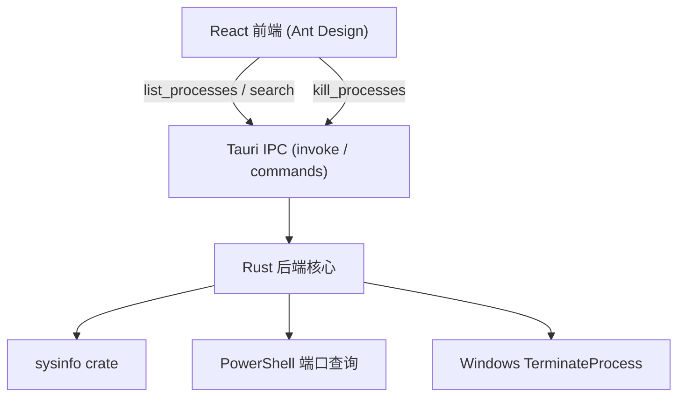

# 进程管理器 (Process Manager)

Feature Name: process-manager
Updated: 2026-08-26

## Description

一个基于 Tauri 2.x 的 Windows 桌面小工具。用户输入端口号、进程名称或 PID，应用搜索并展示匹配进程的详细信息（PID、名称、CPU、内存、端口、路径），用户可选中一个或多个进程并结束它们。

## Architecture



- **前端 (React + Vite + Ant Design)**: 搜索框、进程表格（支持多选）、结束确认弹窗、刷新与自动刷新。
- **Tauri IPC 层**: 通过 `#[tauri::command]` 暴露后端能力，前端使用 `@tauri-apps/api` 的 `invoke` 调用。
- **Rust 后端**: 负责获取进程列表、建立端口映射、执行结束操作、受保护进程判定。

## Components and Interfaces

### Rust 后端

| 组件 | 职责 |
|------|------|
| `commands.rs` | 定义 Tauri command 入口，组装进程信息 |
| `process.rs` | 基于 `sysinfo` 枚举进程、按关键字过滤 |
| `ports.rs` | 调用 PowerShell 获取端口到 PID 的映射 |
| `killer.rs` | 结束进程（`sysinfo kill` / `TerminateProcess`）、受保护进程判定 |
| `models.rs` | 进程数据结构定义 |

### Tauri Commands

| Command | 输入 | 输出 |
|---------|------|------|
| `list_processes(keyword)` | 可选关键字 `Option<String>`（端口号/名称/PID） | `Vec<ProcessInfo>` |
| `kill_processes(pids)` | PID 列表 `Vec<u32>` | `Vec<KillResult>` |
| `is_admin()` | 无 | `bool` |

### 数据模型

```rust
pub struct ProcessInfo {
    pid: u32,
    name: String,
    cpu: f32,          // 百分比
    memory: u64,       // 字节
    path: Option<String>,
    ports: Vec<u16>,   // 该进程监听的端口
    protected: bool,   // 是否受保护
}

pub struct KillResult {
    pid: u32,
    ok: bool,
    error: Option<String>,
}
```

### 端口映射获取策略

1. 执行 PowerShell：`Get-NetTCPConnection`（Listen 状态）+ `Get-NetUDPEndpoint`，输出 JSON。
2. 解析输出，建立 `HashMap<u32, Vec<u16>>`（PID -> 端口列表）。
3. 若 PowerShell 调用失败，返回空映射，进程列表仍可正常展示（端口字段为空）。

### 受保护进程列表

`System Idle Process`、`System`、`smss.exe`、`csrss.exe`、`wininit.exe`、`services.exe`、`lsass.exe`、`winlogon.exe`、`dwm.exe` 等系统关键进程禁止结束。

### 管理员权限

`tauri.conf.json` 的 Windows 配置中设置 `requestedExecutionLevel: requireAdministrator`，应用默认以管理员权限启动，保证能结束普通权限无法结束的进程。

## Data Models

见上文 `ProcessInfo` / `KillResult`。前端 Ant Design Table 的 rowKey 使用 `pid`。

## Correctness Properties

1. 受保护进程在任何情况下均不可被结束。
2. `kill_processes` 对每个 PID 独立返回结果，单个失败不影响其余进程的结束。
3. 搜索关键字为空时返回全部进程，不抛异常。
4. 端口号输入非数字时按名称匹配处理；输入为纯数字且存在匹配端口时按端口匹配。

## Error Handling

| 场景 | 处理方式 |
|------|---------|
| 进程列表获取失败 | 返回空列表并向前端返回错误信息，前端展示提示 |
| PowerShell 端口查询失败 | 记录错误，返回空端口映射，不阻断列表展示 |
| 结束进程权限不足 | `KillResult.ok=false`，`error` 提示"以管理员身份运行" |
| 进程已退出 | `KillResult.ok=false`，`error` 提示"进程已不存在" |
| 结束受保护进程 | 前端预判阻止 + 后端二次校验双重保障 |

## Test Strategy

- **Rust 单元测试**: 受保护进程判定、端口映射 JSON 解析、关键字匹配逻辑（端口/名称/PID 分支）。
- **手动验证**: 在 Windows 上构建后验证搜索、多选结束、自动刷新、管理员权限提示。

## References

[^1]: (Website) - [Tauri 2.x 官方文档](https://tauri.app)
[^2]: (Website) - [sysinfo crate](https://crates.io/crates/sysinfo)
[^3]: (Website) - [Ant Design](https://ant.design)
